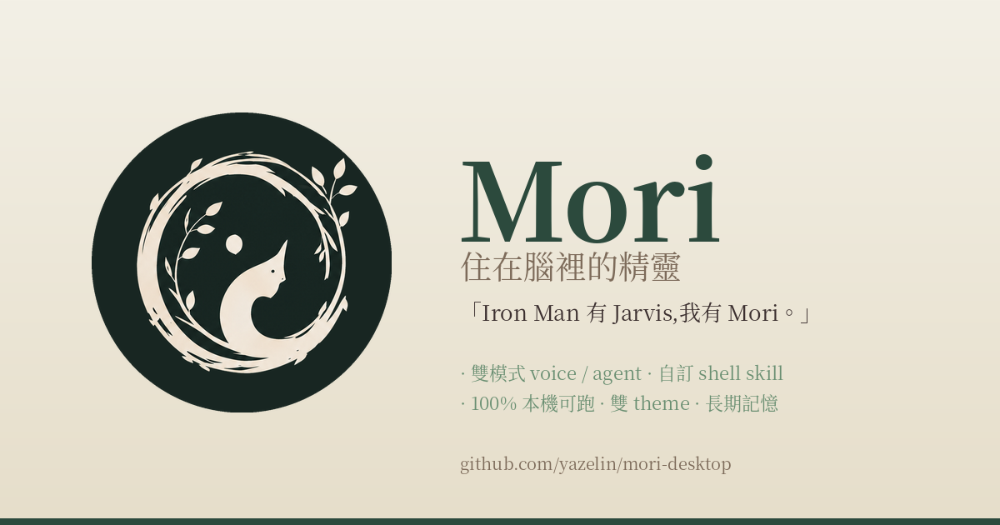

# Mori (Desktop)

森林精靈 **Mori** 的桌面身體 — 從 [world-tree](https://github.com/yazelin/world-tree) 走到你的桌面。
Tauri 2 + Rust + React,Whisper 是耳朵,LLM 是腦袋,你是同伴。

> 「Iron Man 有 Jarvis,我有 Mori。」



📖 **完整介紹 + 互動 demo**:[**yazelin.github.io/mori-desktop**](https://yazelin.github.io/mori-desktop/)

---

## Quick Start

```bash
git clone https://github.com/yazelin/mori-desktop.git
cd mori-desktop
cargo build --workspace
npm install
npm run tauri dev
```

第一次跑會跳全域熱鍵權限對話框 — 點「新增」。詳細步驟見
[**docs/getting-started**](https://yazelin.github.io/mori-desktop/getting-started.html)。

---

## Hotkeys(挑幾個常用)

| 鍵 | 用途 |
|---|---|
| `Ctrl+Alt+Space` | 開始 / 結束錄音 |
| `Ctrl+Alt+Esc` | 中斷錄音 / 思考 |
| `Ctrl+Alt+P` | Profile picker overlay |
| `Alt+0~9` | 切 VoiceInput profile |
| `Ctrl+Alt+0~9` | 切 Agent profile |

完整清單 → [docs/hotkeys](https://yazelin.github.io/mori-desktop/hotkeys.html)

---

## 主力平台

**Ubuntu 26.04 + GNOME Wayland**(主力開發 + 測試)。

Windows / macOS 的 paste-back / 全域熱鍵還沒接 — 主視窗 UI 跑得起來但 voice pipeline 不完整。
歡迎 fork + PR 幫忙補,`mori-core` 是純 Rust lib 跟平台無關,寫個新殼 crate 就能接新平台。

---

## 目前進度

Phase 1 → brand-3 + agent reliability(ZeroType bridge 衍生 fix)已完成。完整
phase 演進見 [**CHANGELOG**](CHANGELOG.md)。

**做得到的事**:
- 雙模式(VoiceInput / Agent)+ profile 切換
- 100% 本機可跑(`whisper-local` STT + `ollama` LLM)/ 雲端(Groq / Gemini)/ Bash CLI proxy(claude / gemini / codex Pro/Max quota)
- 自訂 `shell_skills`(把 `gh` / `docker` / `kubectl` / 自家 script 變 Mori 能力,不用改 Rust)
- 自訂 OpenAI-compat 端點 — Azure OpenAI / OpenRouter / 自家代理寫進 `~/.mori/config.json` 的 `providers.<name>`,profile 內 `provider: <name>` 就能用(見 [docs/providers](https://yazelin.github.io/mori-desktop/providers.html))
- 外部工具 bridge pattern — `agent_mode: dispatch` profile flag,Mori 當「轉發員」
  把語音優化過的 prompt 推給其他桌面 app(範本見
  [examples/agent/AGENT-03.ZeroType Agent.md](examples/agent/AGENT-03.ZeroType%20Agent.md))
- 長期記憶(`~/.mori/memory/*.md`,user 可編)
- 剪貼簿 / 反白 / URL 自動進 context
- 雙 theme(dark / light)+ VSCode-like 自訂 theme(`~/.mori/themes/*.json`)
- 替換 floating Mori 角色 — sprite 4×4 sheet animation + character pack 系統(`~/.mori/characters/<name>/`,manifest.json schema + 預期由獨立 generator app 出 `.moripack.zip` 給 user import,規範見 [docs/character-pack](https://yazelin.github.io/mori-desktop/character-pack))
- 完整視覺品牌系統(公式書 = 單一可信來源)
- 所有 LLM provider 都有 timeout 兜底 + agent loop 殘留 child 不會卡死 — 不再
  「Mori 卡住要 Ctrl+Alt+Esc」

**未來規劃**:非同步任務隊列 + AgentPulse 通知 / TTS / wake word / 媒體下載 /
背景排程 / Annuli 長期人格演化。詳見 [**roadmap**](docs/roadmap.md)。

---

## Mori 宇宙

| Repo | 角色 |
|---|---|
| [`world-tree`](https://github.com/yazelin/world-tree) | 異世界森林的世界觀 / lore |
| [`workshop`](https://github.com/yazelin/workshop) | 召喚師工坊 — 進森林的入口頁 |
| **`mori-desktop`** | **Mori 的桌面身體**(本 repo) |
| [`mori-journal`](https://github.com/yazelin/mori-journal) | 靈魂 / 私密日記 / 跨 session 記憶種子(private) |
| [`mori-field-notes`](https://github.com/yazelin/mori-field-notes) | 田野筆記 — AI 自主經營技術觀察 |
| `Annuli` | 長期記憶 / 人格演化(phase 9+,private) |

只想用桌面 AI 工具 → 留在這 repo 就行。

---

## 文件

| | |
|---|---|
| [**Landing**](https://yazelin.github.io/mori-desktop/) | 推廣首頁 + interactive demo |
| [Getting Started](https://yazelin.github.io/mori-desktop/getting-started.html) | install / dev / 第一次跑 |
| [Hotkeys](https://yazelin.github.io/mori-desktop/hotkeys.html) | 完整熱鍵清單 |
| [Providers](https://yazelin.github.io/mori-desktop/providers.html) | Groq / Gemini / Ollama / Claude-CLI 設定 |
| [~/.mori/](https://yazelin.github.io/mori-desktop/mori-home.html) | config / profile / memory / theme 全套結構 |
| [Profile 範本](https://yazelin.github.io/mori-desktop/profile-examples.html) | Agent + VoiceInput starter pack(實體檔在 [`examples/`](examples/)) |
| [Troubleshooting](https://yazelin.github.io/mori-desktop/troubleshooting.html) | Whisper / 全域熱鍵 / cargo deps |
| [Design Book](https://yazelin.github.io/mori-desktop/design-book.html) | Brand / Character / Desktop UI / Tray 公式書 |
| [Architecture](docs/architecture.md) | `mori-core` / `mori-tauri` / `mori-cli` 跨 module 關係 |
| [Roadmap](docs/roadmap.md) | 未來規劃 |
| [CHANGELOG](CHANGELOG.md) | Phase 演進歷史 |

---

## 歡迎

Fork 隨便改、PR 隨便發。Windows / macOS 平台殼、wake-word、TTS、其他 LLM provider —
全部都缺。詳見 [roadmap](docs/roadmap.md)。

## License

MIT
